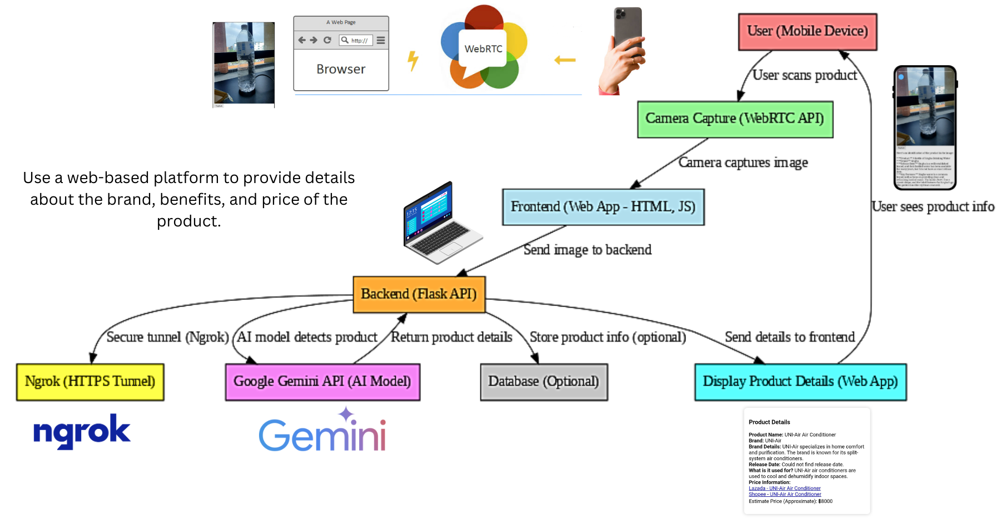

# ProdScan - AI-Based Product Identification System

Repo for demo idea, model, and code for ICT720 course of 2025.


## Team Members
1. Thanawin Ungkananuchat  
2. Sahatus Asawadilockchai  
3. Rady LY  

---

## **User Stories**
1. **As a consumer**, I want to scan any product using my smartphone camera, so that I can get details about it instantly.
2. **As a store manager**, I want to identify products in my inventory using AI, so that I can quickly check specifications and pricing.
3. **As a production operator**, I want to register and categorize products efficiently, so that I can optimize stock management.

---

## **Project Overview**
This project enables **real-time product recognition** using **a smartphone camera and AI**.  
Users can scan **any random product (electronics, food, household items, etc.)**, and the system will identify it using **Google Gemini API**, providing details like **brand, release date, price, and specifications**.

---

## **Features**
- Scan any product using a smartphone camera
- AI-based product recognition using Google Gemini API
- Displays brand, release date, key specifications, and price (if available)
- Works on mobile devices without app installation
- HTTPS support via Ngrok for iOS compatibility
- Supports multiple product categories (smartphones, electronics, food, etc.)
- **QR Code Tracking**: Number of users scanning the QR code updates in real-time
- **Integration with 5Strack IoT Development Kit WM8978** for tracking and scanning

---

## **Scan Results**
When a user scans a product, the system displays the product details in real-time. Example result:


### **Example Output:**
- **Product Name**: UNI-Air Air Conditioner
- **Brand**: UNI-Air
- **Brand Details**: Specializes in home comfort and purification
- **Release Date**: Not found
- **Usage**: Cooling and dehumidifying indoor spaces
- **Price Information**: Links to online marketplaces
- **Estimate Price**: ฿8000

Videos demonstrating the scanning process will be available soon.

---

## **Database Schema**
The scanned product data is stored in an SQLite database with the following schema:

| Name            | Type    | Description |
|----------------|---------|-------------|
| id             | INTEGER | Unique ID (Primary Key) |
| product_name   | TEXT    | Name of the product |
| brand          | TEXT    | Product brand |
| brand_details  | TEXT    | Details about the brand |
| release_date   | TEXT    | Product release date |
| usage          | TEXT    | What the product is used for |
| price          | TEXT    | Estimated price |
| scan_time      | TEXT    | Timestamp of the scan |

---

## **Tech Stack**

| Component  | Technology Used |
|------------|----------------|
| **Frontend (Web UI)** | HTML, WebRTC API |
| **Backend (API Server)** | Flask (Python) |
| **AI Model (Product Recognition)** | Google Gemini API |
| **Camera Access** | WebRTC API (Back Camera) |
| **Secure Connection** | Ngrok (for HTTPS) |
| **Product Data Retrieval** | Web Scraping / External APIs (Amazon, Walmart, etc.) |
| **Hardware Integration** | 5Strack IoT Dev Kit WM8978 |

---

## **Setup & Installation**

### **Install Dependencies**
```bash
pip install flask requests
```

### **Run the Server**
```bash
python app.py
```

### **Access the Web Scanner**
Navigate to `http://localhost:5000` or use an Ngrok link for remote access.

---

## **Future Enhancements**
- Improve AI recognition accuracy
- Add more product categories
- Implement user authentication for product tracking
- Enhance QR tracking functionality

Let us know if you have any feedback or suggestions!
